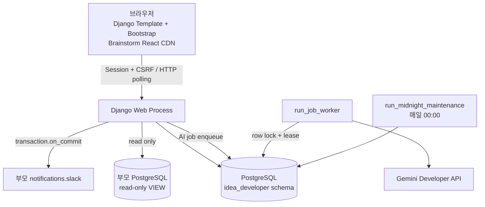

# 시스템 아키텍처

## 1. 목적과 범위

Idea Developer는 PRD 작성, 브레인스토밍, AI 지원과 기여도 평가를 제공하는 독립 Django
시스템이다. 부모 운영 저장소의 사용자·회차·팀 원장을 복제하거나 수정하지 않으며, 통합 시에는
인증 resolver, base template과 URL include 지점만 교체할 수 있도록 경계를 둔다.

## 2. 실행 구조

Redis, Celery, Django Channels와 브라우저 Babel/Tailwind 런타임은 필수 구성에 포함하지 않는다.

## 3. Django 앱 책임

| 앱 | 책임 |
|---|---|
| `accounts` | OTP, 최소 로컬 사용자 매핑, session, 로그인 감사와 역할 정책 |
| `integration` | 부모 unmanaged VIEW, 읽기 전용 repository, `IntegrationContextResolver` |
| `prds` | PRD aggregate, 템플릿, 참여자, 질문·답변, 코멘트, 홈 집계, 삭제·상태 정책 |
| `brainstorm` | 버전 보드, 노드·연결선, viewport, polling change log와 audit log |
| `ai` | prompt version, 작업·사용 로그, Gemini adapter, 코치, PRD 반영, 기여도 |
| `jobs` | AI worker, TTL 정리와 자정 유지보수 management command |
| `common` | 공통 응답, request ID·로깅, root routing과 Slack adapter |

## 4. 주요 요청 흐름

### 인증과 Context

1. Django session에서 `LocalUserMapping`을 확인한다.
2. 외부 `user_id`를 부모 사용자 VIEW에서 활성·승인 상태로 재검증한다.
3. 회차 기능은 `user_id + round_id`를 회차 팀 VIEW에서 검증한다.
4. `IntegrationContext`와 PRD 참여 역할을 결합해 각 API 권한을 결정한다.
5. 부모 VIEW 장애 시 검증이 필요한 쓰기는 fail closed한다.

### PRD 편집

1. 요청마다 로그인·PRD 역할을 재검사한다.
2. PRD aggregate 또는 대상 resource를 transaction 안에서 잠근다.
3. 클라이언트 version과 서버 version이 다르면 `409 Conflict`와 최신 데이터를 반환한다.
4. 성공한 변경은 version과 변경 이력을 갱신한다.
5. 프론트는 충돌 시 작성 중 내용을 보존하고 최신 상태 재조회 여부를 묻는다.

### 브레인스토밍 동기화

1. 최초 진입은 최신 캔버스 전체 상태를 조회한다.
2. 이후 2~5초 간격으로 증가 cursor 이후의 change log를 조회한다.
3. cursor 만료·네트워크 재연결 시 노드·연결선·통계를 전체 재조회한다.
4. 드래그 중간 좌표는 저장하지 않고 pointer release에서 최종 좌표만 PATCH한다.

### AI 작업

1. 웹 프로세스가 활성 prompt와 사용량 제한을 확인하고 `ai_jobs`에 idempotent하게 등록한다.
2. worker가 `select_for_update(skip_locked)`와 lease를 사용해 작업을 점유한다.
3. Gemini에는 system instruction과 사용자 데이터를 분리하고 JSON schema 출력을 요청한다.
4. 반환 ID와 schema를 현재 DB snapshot에 다시 대조한다.
5. 실행 결과와 토큰·비용·실패를 `ai_usage_logs`에 기록한다.

## 5. 일관성과 장애 처리

- DB 제약조건과 애플리케이션 검증을 함께 사용한다.
- 중복 생성은 idempotency key와 unique constraint를 함께 사용한다.
- PRD 완료 후 일반 편집은 잠그고 owner·관리자 재개만 허용한다.
- Slack 실패는 도메인 transaction을 되돌리지 않고 최대 3회 재시도한다.
- AI 실패는 PRD 완료를 취소하지 않으며 기여도 실패 상태와 근거를 보존한다.
- 소프트 삭제 데이터는 30일 동안 복구할 수 있고 자정 유지보수에서 batch 영구 삭제한다.

## 6. 관련 문서

- `requirements/CURRENT_REQUIREMENTS.md`
- `api/README.md`
- `database/ERD.md`
- `database/DATA_DICTIONARY.md`
- `QUALITY_ASSURANCE.md`
- `08_PARENT_HANDOFF.md`
