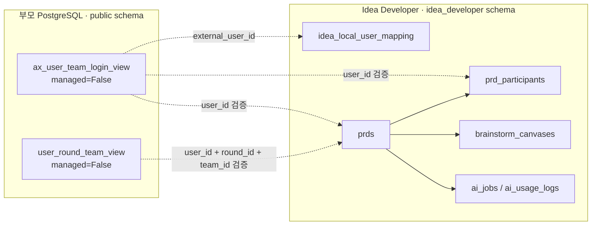
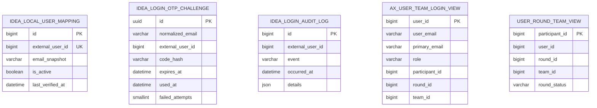
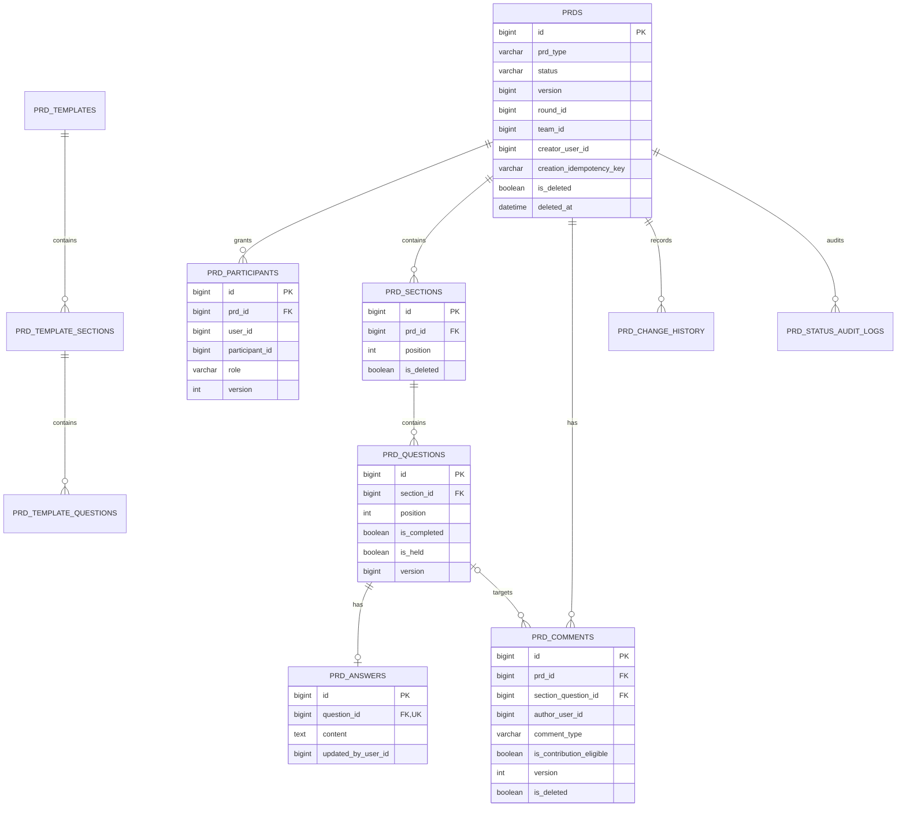
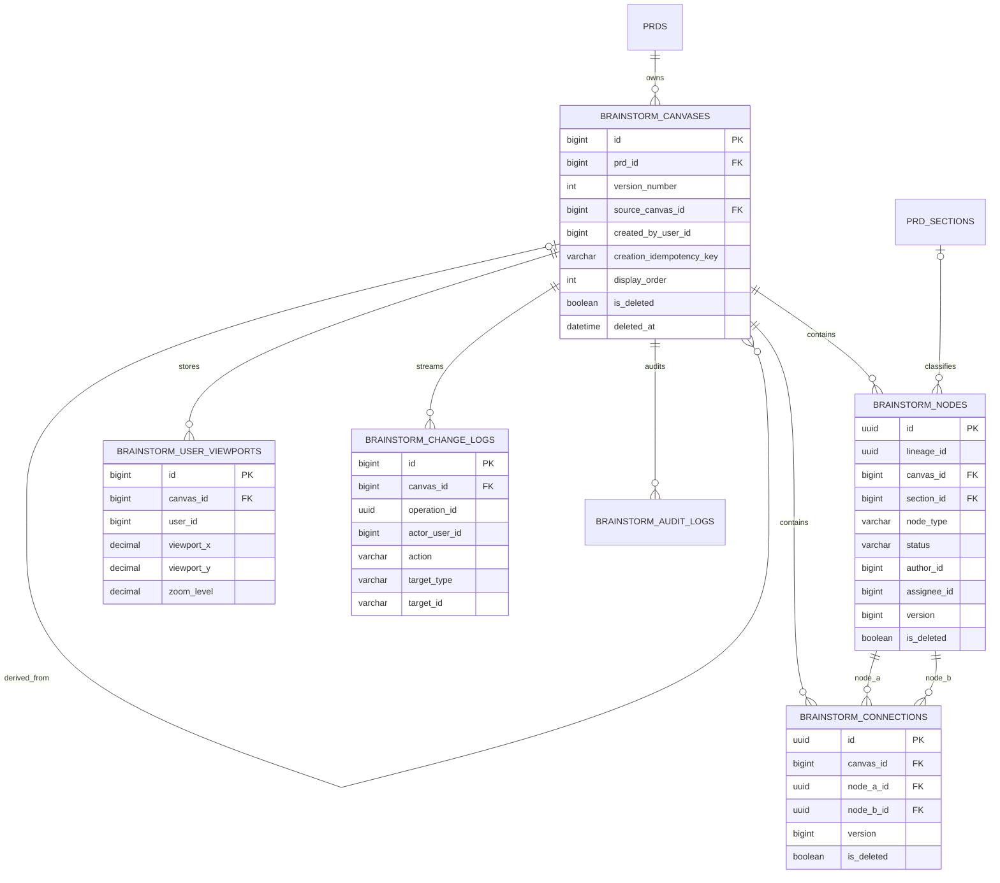
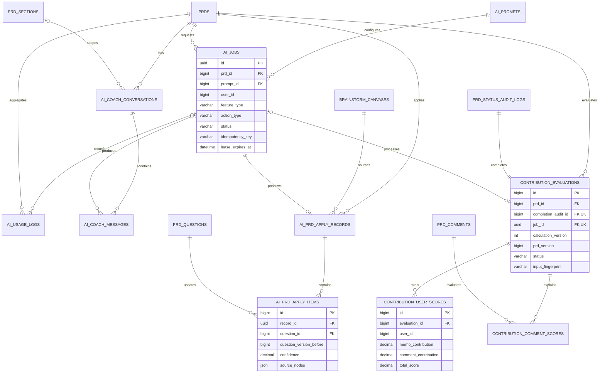

# Idea Developer ERD

> 기준: Django 모델 및 migration, 2026-09-07

## 1. 시스템 경계

부모 시스템은 사용자·회차·팀 원장을 소유하고, Idea Developer는 PRD·브레인스토밍·AI 결과를
소유한다. 두 영역은 물리 FK가 아닌 외부 식별자와 읽기 전용 VIEW 계약으로 연결한다.

부모 VIEW에는 `INSERT`, `UPDATE`, `DELETE`를 실행하지 않는다. `creator_user_id`, `user_id`,
`author_user_id`, `actor_user_id`, `round_id`, `participant_id`, `team_id`는 부모 원장의 외부 ID다.

## 2. 인증·연동

인증·감사 테이블은 의도적으로 부모 VIEW와 FK를 맺지 않는다. 세션 사용자는
`LocalUserMapping.external_user_id`로 부모 사용자와 매핑하고, 로그인 및 중요 쓰기 전에 VIEW를
다시 검증한다.

## 3. PRD·템플릿·코멘트

`prd_deletion_audit_logs`는 PRD FK가 없는 독립 삭제 사실 원장이다. PRD 영구 삭제 후에도 삭제된
PRD ID와 제목·사용자 snapshot을 보존하기 위해 ER 관계 밖에 둔다.

## 4. 브레인스토밍과 버전 보드

`(prd_id, version_number)`는 유일하다. 최초 진입은 활성 캔버스를 `display_order`, version 역순,
ID 역순으로 정렬한 첫 보드를 연다. 첫 보드만 최신·편집 가능하며, 순서 변경은 PRD 행 잠금 안에서
전체 활성 ID를 검증해 원자적으로 적용한다. 최신 보드는 소프트 삭제하고 다음 보드를 승격하되
마지막 활성 보드는 삭제할 수 없다. 복제된 메모는 새 PK와 resource version을 받지만 동일한
`lineage_id`를 유지한다. 연결선은 자기 연결을 금지하고 정렬된 두 node 조합을 유일하게 유지한다.

## 5. AI 작업·코칭·PRD 반영·기여도

AI 작업은 웹 요청과 별도 worker가 PostgreSQL 행 잠금과 lease로 처리한다. 기여도 계산은 완료
감사 로그마다 하나의 평가를 만들고, 재개 후 재완료하면 새 계산 version을 생성한다.

## 6. 삭제 연쇄와 보존

| 부모 행 삭제 | 주요 처리 |
|---|---|
| PRD 영구 삭제 | 참여자·섹션·질문·답변·코멘트·캔버스·AI 작업·상세 기여도는 CASCADE 또는 정리 서비스로 삭제 |
| PRD 삭제 감사 | PRD FK가 없어 최소 삭제 사실은 유지 |
| 질문 삭제 | 답변 CASCADE, 질문 연결 코멘트는 `SET_NULL` |
| 캔버스 삭제 | 노드·연결선·viewport·변경·감사 로그 CASCADE |
| AI prompt | 연결된 작업이 있으면 `PROTECT` |
| AI PRD 반영 질문 | 반영 근거 보존을 위해 `PROTECT` |
| 기여도 대상 코멘트 | 평가 근거 보존을 위해 `PROTECT` |

소프트 삭제와 영구 삭제의 세부 실행 순서는 `run_midnight_maintenance`와
`cleanup_background_data` 서비스가 담당한다.
