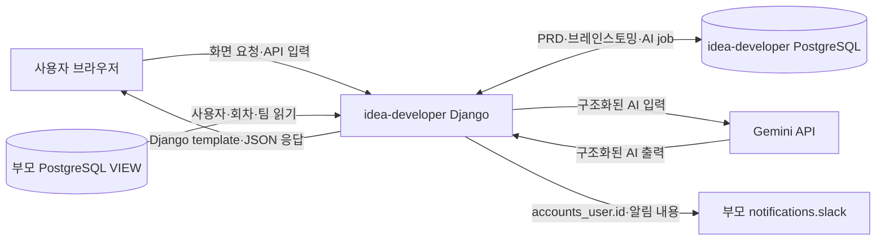
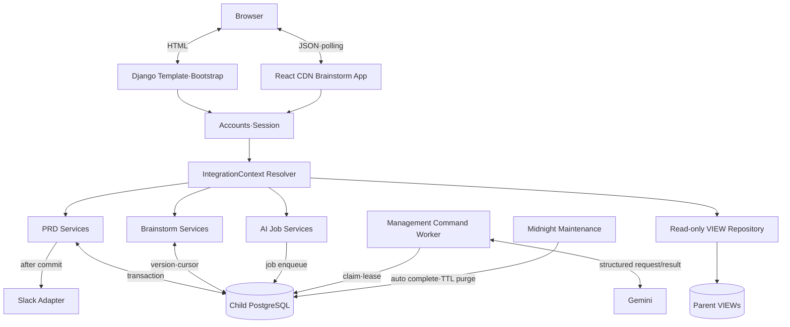
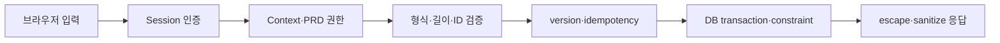

# 데이터 흐름도

## 1. Level 0: 시스템 경계

부모 VIEW는 읽기 전용이다. `idea-developer`는 부모 원본 사용자·회차·팀 테이블을 직접 JOIN하거나
VIEW에 쓰지 않는다.

## 2. Level 1: 애플리케이션 내부 흐름

## 3. 데이터 소유권

| 데이터 | 진실의 원천 | idea-developer 처리 |
|---|---|---|
| 사용자 이름·이메일·활성·부모 역할 | 부모 VIEW | 읽기, 화면 snapshot, session 매핑 |
| 회차 참가자·회차별 팀 | 부모 VIEW | `user_id + round_id` 검증 |
| PRD·섹션·질문·답변 | 자식 PostgreSQL | 생성·편집·version·soft delete |
| PRD 참여 역할 | 자식 PostgreSQL | owner/editor/tutor/viewer 관리 |
| 캔버스·메모·연결선·viewport | 자식 PostgreSQL | 버전 보드·polling·감사 기록 |
| AI prompt·job·사용량·대화·미리보기 | 자식 PostgreSQL | worker 처리·TTL·승인 반영 |
| Slack 사용자 연결 | 부모 notifications 앱 | 공통 발송 함수만 호출 |
| 기여도 결과 | 자식 PostgreSQL | 계산 버전별 보존, 관리자 조회 |

## 4. 신뢰 경계와 검증

- URL의 `round_id`, `team_id`, user ID와 AI 반환 ID는 신뢰하지 않는다.
- DB 제약조건과 application validation을 함께 사용한다.
- 외부 연동 실패 시 이미 commit된 핵심 데이터와 아직 검증되지 않은 쓰기를 구분한다.
- 사용자 입력은 plain text로 저장하고 HTML 출력 경계에서 escape한다.
