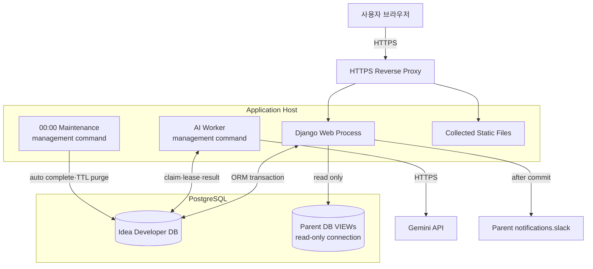

# 배포 구성도

## 1. 프로세스 구성

## 2. 필수 실행 단위

| 실행 단위 | 책임 | 중단 시 영향 |
|---|---|---|
| Django web | 화면, API, session, 권한 검사 | 서비스 요청 불가 |
| PostgreSQL | 제품 데이터, job, polling event | 읽기·쓰기와 worker 중단 |
| AI worker | AI job 처리 | 일반 PRD 기능은 유지, AI job 대기 |
| 자정 유지보수 | 마감 자동 완료, 30일 삭제, 만료 대화·미리보기 정리 | 접근 시 일부 마감 보정, TTL 정리 지연 |
| 부모 VIEW connection | 사용자·회차·팀 검증 | 검증이 필요한 쓰기 fail closed |
| Gemini | AI 응답 | AI job 실패·재시도, 일반 편집 유지 |
| Slack 공통 모듈 | 참여자·코멘트 DM | 저장 유지, 알림 재시도 후 실패 로그 |

## 3. 배포 설정 경계

- secret key, DB 비밀번호, Gemini key와 SMTP 정보는 환경변수 또는 배포 secret 저장소로 주입한다.
- 부모 VIEW DB 계정은 읽기 전용이고 migration router가 쓰기를 차단해야 한다.
- 운영은 HTTPS redirect, secure session/CSRF cookie, HSTS와 정확한 allowed hosts를 사용한다.
- React·ReactDOM CDN origin은 부모 CSP에 명시하되 Babel과 Tailwind runtime은 추가하지 않는다.
- web과 worker는 같은 배포 artifact를 사용하되 별도 프로세스로 실행한다.
- 자정 기준은 서비스 timezone `Asia/Seoul`과 운영 scheduler timezone이 일치해야 한다.

## 4. 배포 후 확인

1. migration 적용 상태와 `/api/v1/health/`를 확인한다.
2. 부모 VIEW의 사용자 조회와 회차 팀 검증을 읽기 전용으로 확인한다.
3. 로그인, 홈 첫 페이지, PRD 저장과 version 충돌을 smoke test한다.
4. 테스트 AI job 하나가 worker에서 완료되는지 확인한다.
5. 자정 유지보수 명령을 dry-run 또는 안전한 테스트 데이터로 확인한다.
6. Slack 미연동 사용자와 전송 실패가 핵심 저장을 취소하지 않는지 확인한다.
