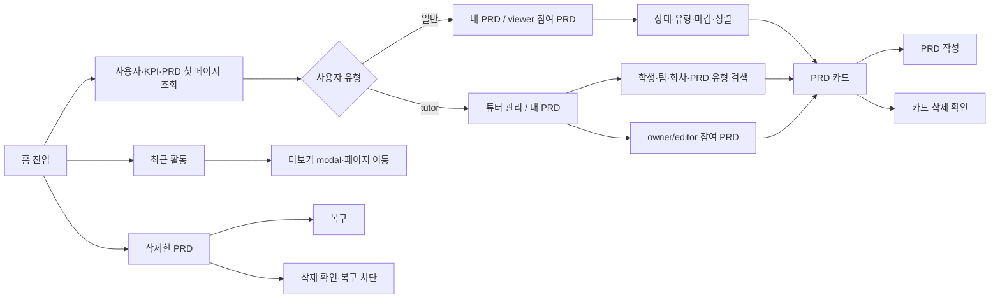
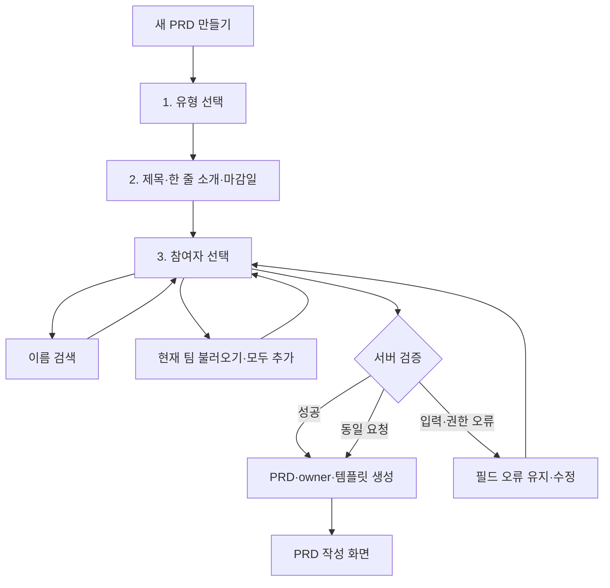
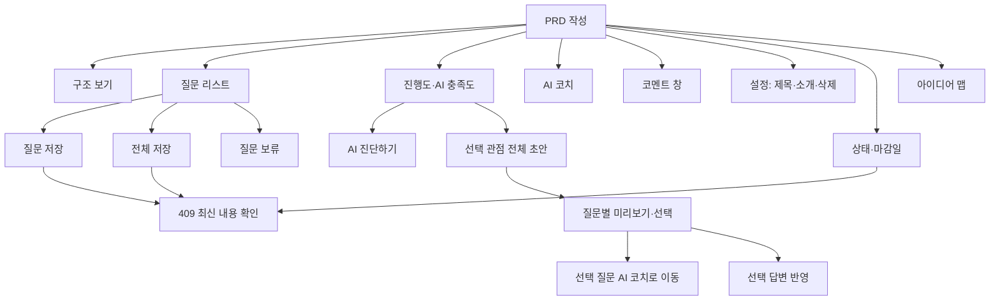
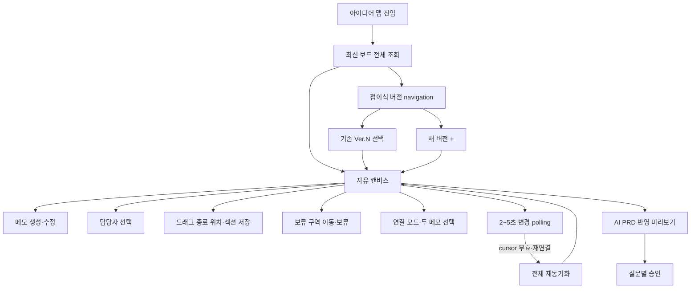

# 화면 흐름도

## 1. 전체 화면 흐름

```mermaid
flowchart TD
    Root[/ 접속]
    Session{로그인 session?}
    Login[운영 OTP 로그인]
    DevLogin[DEBUG 개발 로그인]
    Home[홈 /ideas/]
    Mode{대시보드 유형}
    Standard[일반: 내 PRD·viewer PRD]
    Tutor[튜터: 튜터 관리·내 PRD]
    New[새 PRD /ideas/prds/new/]
    Detail[PRD 작성 /ideas/prds/:id/]
    Brain[아이디어 맵 /ideas/prds/:id/brainstorm/]
    Trash[삭제한 PRD modal]
    Empty[빈 상태]

    Root --> Session
    Session -- 아니오·운영 --> Login
    Session -- 아니오·DEBUG --> DevLogin
    Login -- 검증 성공 --> Home
    DevLogin -- 사용자 선택 성공 --> Home
    Session -- 예 --> Home
    Home --> Mode
    Mode -- 일반 --> Standard
    Mode -- tutor --> Tutor
    Standard --> New
    Tutor -- 내 PRD --> New
    Standard --> Detail
    Tutor --> Detail
    Standard --> Trash
    Standard -- 결과 없음 --> Empty
    Tutor -- 결과 없음 --> Empty
    Detail --> Brain
    Brain --> Detail
    Detail -- 삭제 완료 --> Home
    Trash -- 복구 --> Home
```

## 2. 홈 대시보드



필터 변경은 전체 페이지를 임의로 섞지 않고 서버에 다시 요청한다. 검색어를 지우거나 전체 보기로
돌아가면 필터 없는 첫 페이지를 다시 조회한다.

## 3. 새 PRD 만들기



회차가 없더라도 개인·일반 팀 PRD를 만들 수 있다. `현재 팀` 기능은 유효한 회차 참가정보가 있을
때만 사용하고, 최종 참여자는 서버에서 다시 검증한다.

## 4. PRD 작성 화면



저장은 자동 저장으로 오해하지 않도록 버튼 동작과 완료 알림을 표시한다. 성공·실패 알림은 화면
레이아웃을 밀지 않는 toast 또는 고정 overlay로 표시한다.

`AI 진단하기`는 한 번의 요청으로 세 관점을 진단한다. `AI 초안 작성`은 현재 선택한 한 관점으로
전체 질문의 초안을 생성하며, 질문별 선택 승인 전에는 기존 답변을 변경하지 않는다.

## 5. 브레인스토밍 화면



메모·연결선은 응답 성공 시 로컬 화면을 즉시 갱신하고 polling은 다른 사용자 변경을 보완한다.
version 충돌이 발생하면 로컬 내용을 조용히 덮어쓰지 않는다.

## 6. 오류 후 이동 원칙

| 오류 | 화면 동작 |
|---|---|
| 로그인 만료 | 내부 `next`를 보존하고 로그인으로 이동 |
| 접근 권한 없음 | 홈으로 돌아갈 수 있는 권한 안내 화면 |
| PRD 없음·삭제됨 | 404 후 홈 이동 선택 제공 |
| 입력 오류 | 현재 modal·drawer·form과 입력값 유지 |
| version 충돌 | 최신 데이터 표시 후 사용자가 다시 저장하도록 함 |
| 네트워크 오류 | 입력 유지, 재시도 제공, 성공으로 표시하지 않음 |
| AI 작업 실패 | PRD 내용 유지, 같은 화면에서 재시도 제공 |
| PRD 삭제 성공 | 홈으로 이동하고 `삭제 완료` 표시 |
