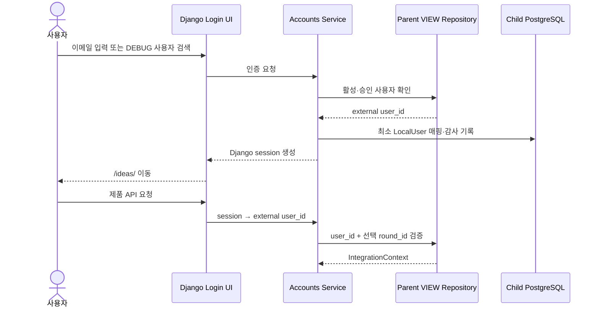
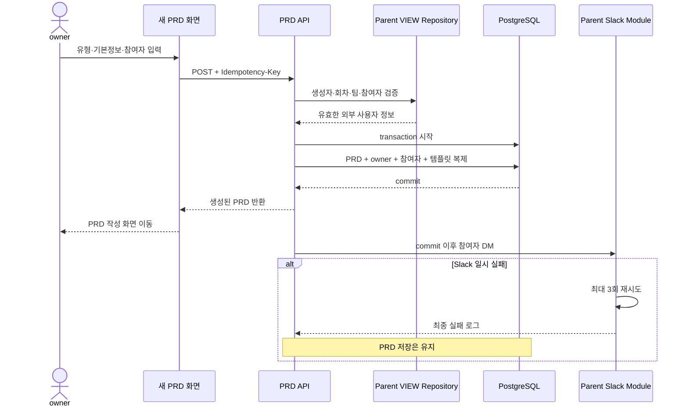
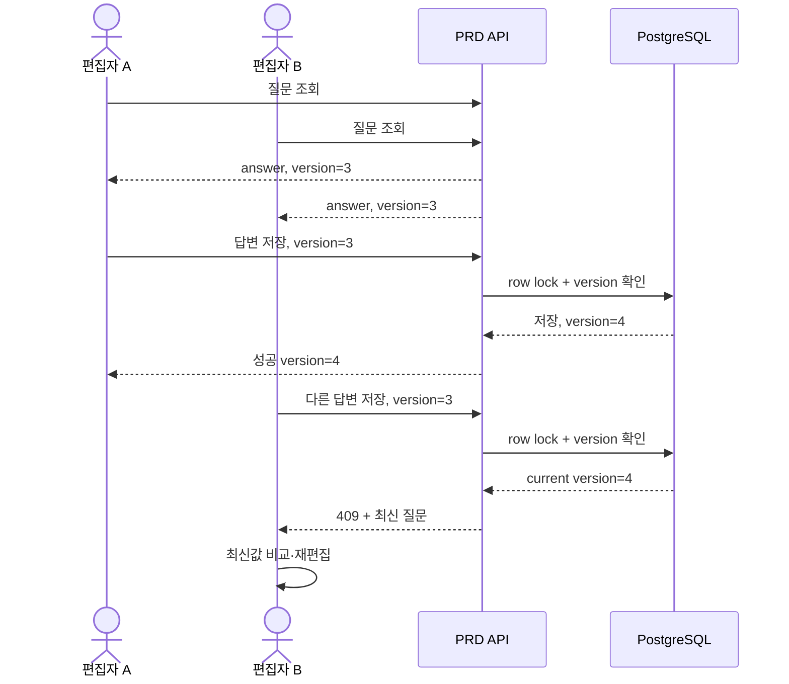
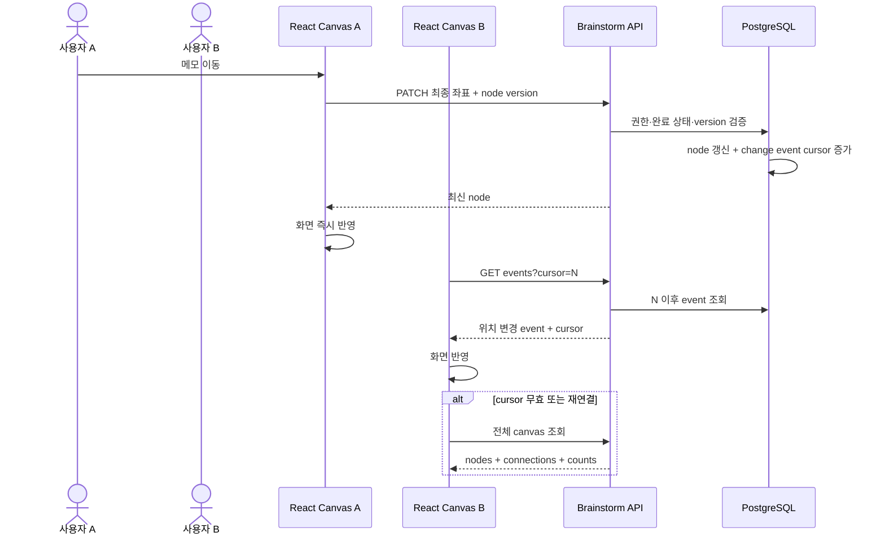
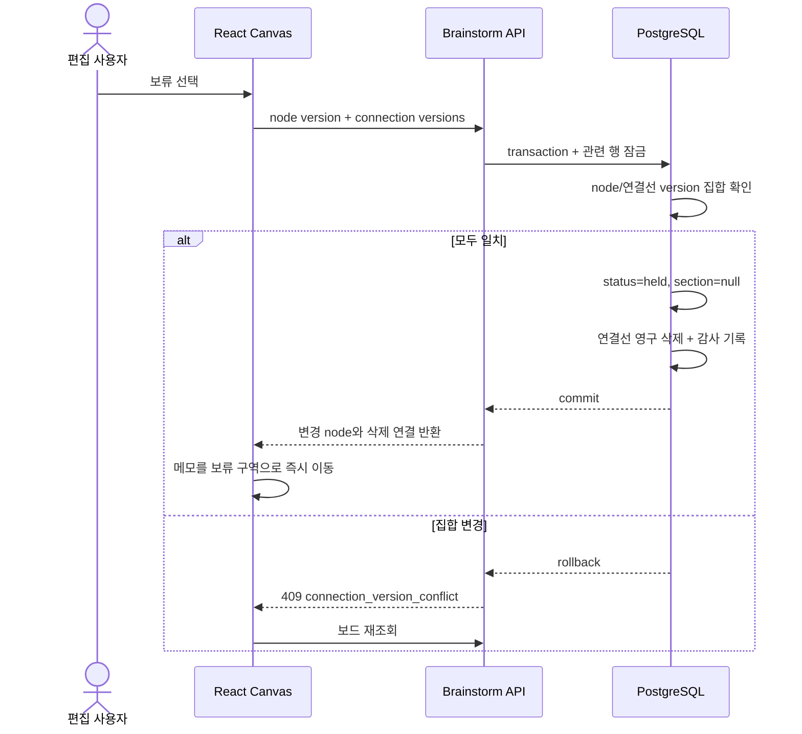
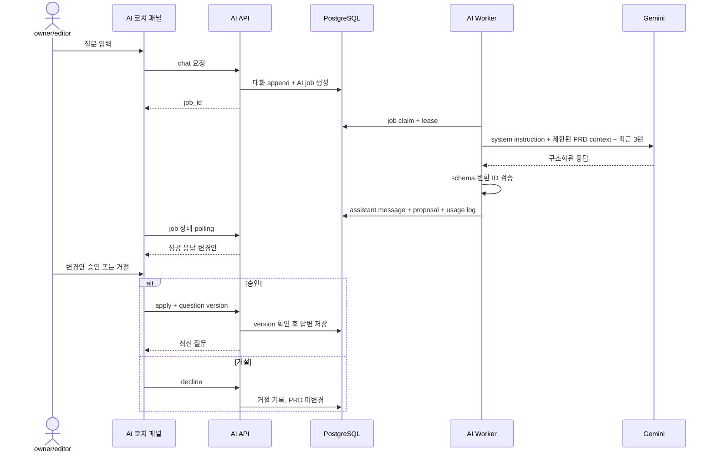
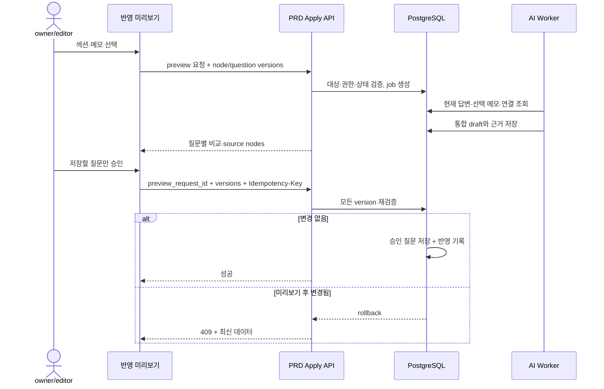
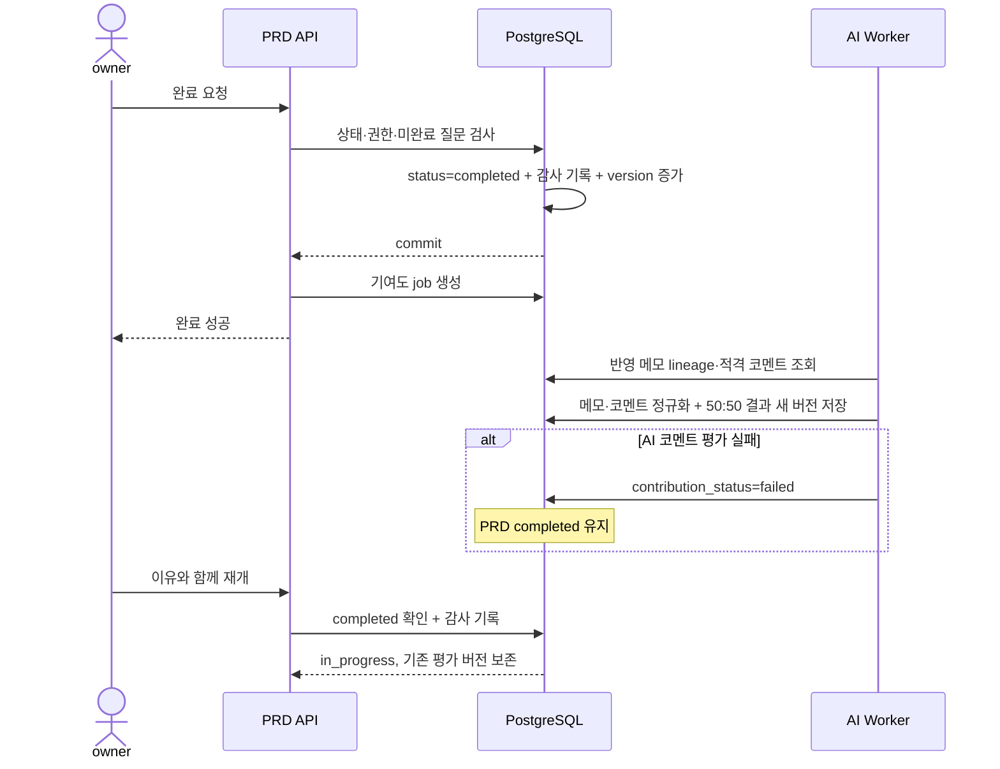
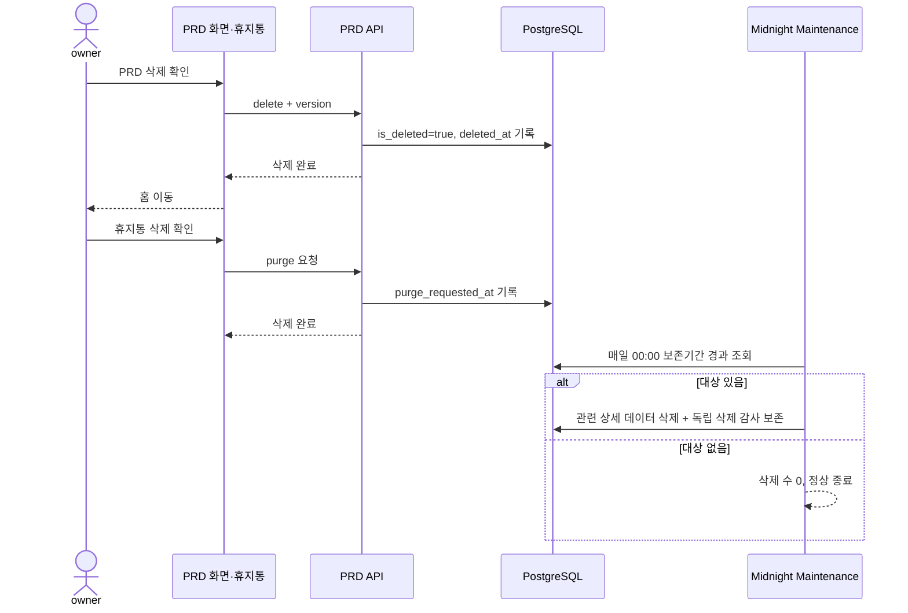

# 주요 기능 시퀀스

## 1. 로그인과 IntegrationContext

VIEW 장애나 참가정보 불일치가 발생하면 검증이 필요한 쓰기 요청은 실행하지 않는다.

## 2. PRD 생성과 Slack 참여 알림

동일 key·동일 payload의 재요청은 최초 생성 결과를 재사용한다.

## 3. PRD 질문 공동 편집

서버는 마지막 요청으로 조용히 덮어쓰는 last-write-wins 방식을 사용하지 않는다.

## 4. 브레인스토밍 변경과 polling

드래그 중간 좌표는 저장하지 않고 종료 좌표만 전송한다.

## 5. 보류와 연결선 정리

## 6. AI 코치와 변경안 승인

## 7. 브레인스토밍 PRD 반영

## 8. 완료·기여도·재개

## 9. 30일 삭제와 자정 유지보수

