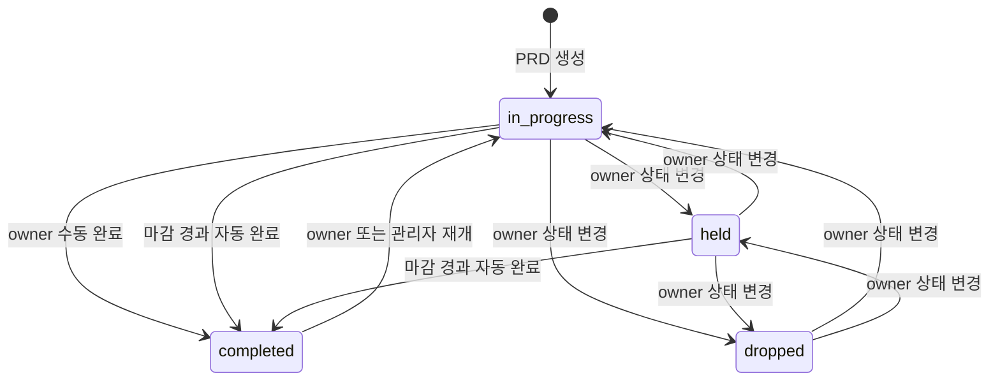
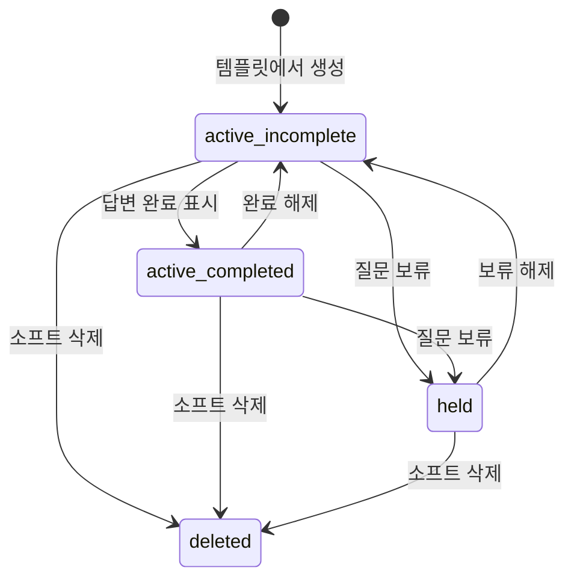
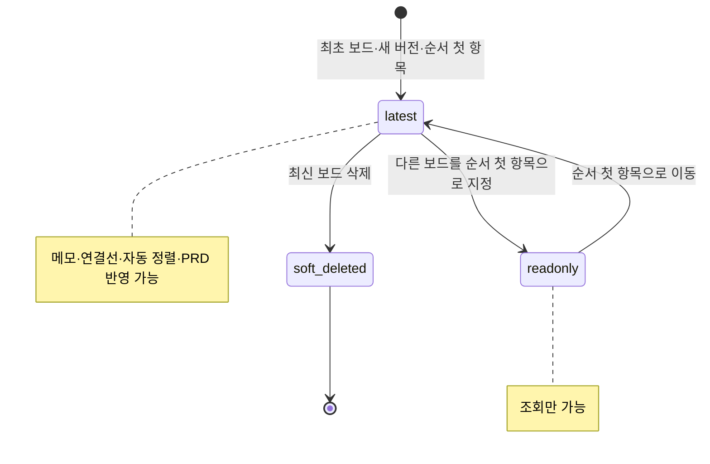
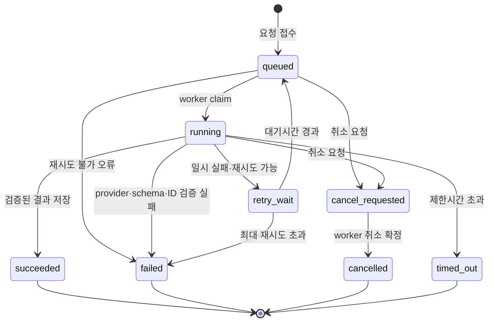
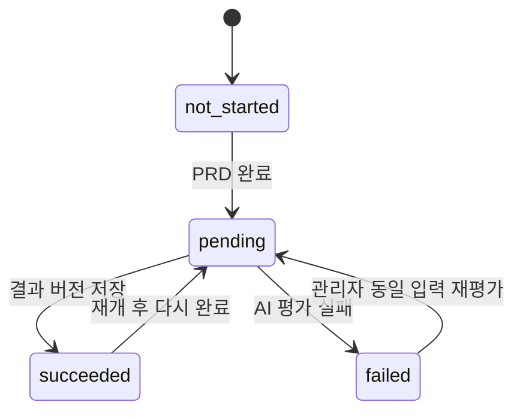
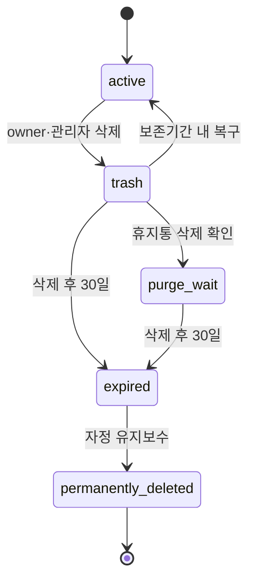

# 상태 전이도

## 1. PRD 상태



- 수동 완료 시 미완료 활성 질문이 있으면 명시적 확인이 필요하다.
- 자동 완료 후 재개하려면 마감일을 오늘 이후로 변경한다.
- `completed`에서는 일반 편집이 잠기며 tutor의 완료 후 리뷰만 허용한다.

## 2. 질문 상태

질문은 별도 문자열 상태 대신 `is_completed`, `is_held`, `is_deleted`를 각기 다른 의미로 사용한다.



`held`와 `deleted` 질문은 완성도와 AI PRD 충족도 입력에서 제외한다.

## 3. 브레인스토밍 메모 상태

```mermaid
stateDiagram-v2
    [*] --> default: 미분류에 생성
    default --> accepted: 섹션으로 이동
    accepted --> default: 미분류로 이동
    accepted --> accepted: 다른 섹션·같은 섹션 이동
    default --> held: 보류
    accepted --> held: 보류
    held --> accepted: 보류 직전 섹션이 유효
    held --> default: 직전 섹션 없음·삭제됨
    default --> soft_deleted: 사용자 삭제
    accepted --> soft_deleted: 사용자 삭제
    held --> soft_deleted: 사용자 삭제
    soft_deleted --> default: 관리자 정책상 복원
    soft_deleted --> [*]: 30일 경과 영구 삭제
```

- `title` 노드는 일반 메모 상태·작성자·담당자 규칙의 대상이 아니다.
- held 전환은 section을 비우고 모든 연결선을 영구 삭제한다.
- 보류 직전 섹션은 `held_from_section_id`에 기억하고, 해제 시 유효한 경우 그 섹션으로 돌아간다.
- 단순 섹션 이동과 담당자 변경은 내용 기여자로 계산하지 않는다.

## 4. 브레인스토밍 보드 상태



최신 삭제는 활성 보드가 두 개 이상일 때만 가능하며 다음 순서 보드를 같은 transaction에서 최신으로
승격한다. `latest`는 별도 boolean이 아니라 활성 보드의 `display_order` 정렬 결과로 계산한다.

## 5. AI 작업 상태



완료된 작업을 다시 취소하거나 재시도하면 `409 invalid_job_state`를 반환한다.

## 6. 기여도 계산 상태



새 완료 주기는 기존 결과를 덮어쓰지 않고 새로운 `calculation_version`을 만든다.

## 7. PRD 삭제 수명주기



`purge_wait`는 사용자에게 삭제 완료로 보이지만 즉시 물리 삭제하지 않는다. 정리 대상이 없어도
자정 유지보수는 성공한다.
