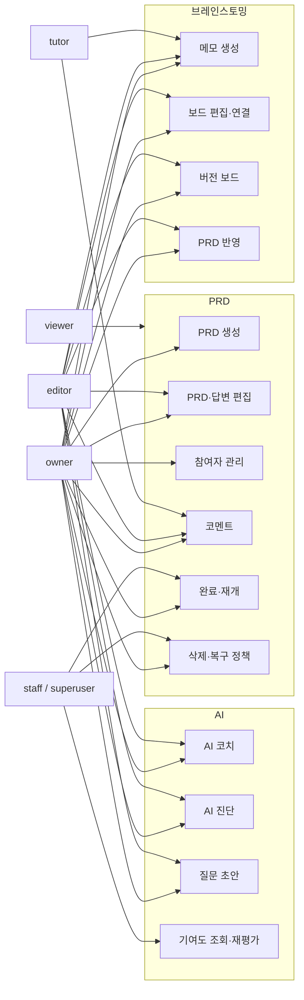

# 기능 구성도·유스케이스

## 1. 사용자 역할

선은 기능 접근을 요약한다. 실제 허용 여부는 PRD 상태, 참여 역할, IntegrationContext와 관리자
여부를 서버가 다시 검사한다.

## 2. 기능 구성

```mermaid
flowchart TB
    Product[Idea Developer]
    Product --> Auth[인증·사용자 연동]
    Product --> Home[홈 대시보드]
    Product --> Prd[PRD 관리]
    Product --> Bs[브레인스토밍]
    Product --> Ai[AI 지원]
    Product --> Ops[운영·보존]

    Auth --> OTP[OTP·DEBUG 로그인]
    Auth --> Context[IntegrationContext]
    Auth --> View[부모 VIEW 읽기]

    Home --> KPI[KPI]
    Home --> Search[필터·정렬·학생 검색]
    Home --> Activity[최근 활동]
    Home --> Trash[휴지통]

    Prd --> Template[유형별 템플릿 생성]
    Prd --> Writing[질문·답변·보류]
    Prd --> Participant[참여자·역할]
    Prd --> Comments[질문별·전체 코멘트]
    Prd --> Status[상태·완료·재개]
    Prd --> Export[PRD Markdown]

    Bs --> Canvas[버전 캔버스]
    Bs --> Nodes[메모·담당자·섹션]
    Bs --> Connections[연결선]
    Bs --> Polling[polling·cursor]

    Ai --> Coaching[코치 대화]
    Ai --> Evaluation[3관점 진단]
    Ai --> PrdApply[미리보기·승인 반영]
    Ai --> Score[기여도 평가]

    Ops --> Job[PostgreSQL AI job]
    Ops --> Slack[Slack 알림]
    Ops --> Midnight[자정 자동완료·영구삭제]
    Ops --> Audit[감사·변경 기록]
```

## 3. 역할별 대표 시나리오

### owner

1. PRD를 만들고 유형별 질문을 생성한다.
2. 참여자를 즉시 추가하고 역할을 관리한다.
3. 답변을 작성하고 브레인스토밍 결과와 AI 제안을 검토해 반영한다.
4. 미완료 질문을 확인한 뒤 PRD를 완료한다.
5. 필요한 경우 이유를 기록하고 재개하거나 PRD를 휴지통으로 보낸다.

### editor

1. 본인이 참여한 과거·현재·회차 없는 PRD를 조회한다.
2. 질문 답변, 일반 코멘트와 브레인스토밍을 공동 편집한다.
3. AI 코치·진단·초안을 요청하고 승인된 제안을 반영한다.
4. 충돌 시 다른 사용자의 최신 내용을 확인한 후 다시 저장한다.

### tutor

1. 튜터 관리 탭에서 본인이 tutor로 배정된 PRD를 조회한다.
2. 해당 PRD의 editor로 등록된 학생을 검색한다.
3. 진행 중에는 지도·리뷰 코멘트와 브레인스토밍 메모를 작성한다.
4. 완료 후에는 `post_completion_review`만 작성하며 PRD 내용은 수정하지 않는다.
5. 별도로 본인이 만든 PRD에서는 owner로 동작한다.

### viewer

본인이 viewer로 참여한 PRD와 브레인스토밍을 조회하지만 수정 요청은 할 수 없다.

### administrator

운영 필요 시 완료 PRD 재개, 삭제·복원 정책과 기여도 결과 조회·동일 입력 재평가를 수행한다.
